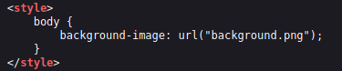

<h1>Trivial</h1>

<h4>First Task</h4>

Name: A little something to get you started 
Category: Web

<h4>Solution</h4>

1. Open the task 
2. They will take you to website with <b>"Welcome to level 0. Enjoy your stay."</b> text. 
  
3. Let's take a look the source code of the page by using <b>view-source</b> or <b>ctrl+u</b> shortcut. 
4. In the css, there's a background image named <b>background.png</b> embedded to the website, but nothing shown as we know. 
   
5. Let's open that images. 
  
6. Voila ~ there is your <b>first flag</b> :D 

